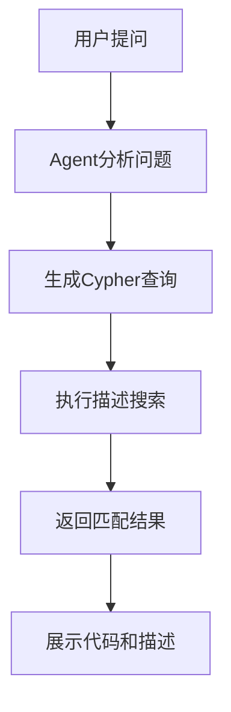

# CodexGraph Agent 描述搜索功能实现说明

## 📋 目录
- [功能概述](#功能概述)
- [实现原理](#实现原理)
- [技术架构](#技术架构)
- [文件修改详情](#文件修改详情)
- [使用示例](#使用示例)
- [测试验证](#测试验证)
- [部署指南](#部署指南)
- [常见问题](#常见问题)

## 🎯 功能概述

### 核心功能
CodexGraph Agent现在具备了**智能描述搜索**能力，能够根据用户的功能性询问，自动搜索包含相关描述的方法和函数节点。

### 解决的问题
- **传统搜索局限**：之前只能通过方法名、类名等精确匹配搜索
- **功能理解困难**：用户需要知道具体的函数名才能找到相关代码
- **搜索效率低**：无法通过功能描述快速定位代码

### 新增能力
- ✅ **语义搜索**：通过功能描述搜索相关代码
- ✅ **模糊匹配**：支持关键词模糊匹配
- ✅ **智能查询**：Agent自动生成合适的Cypher查询
- ✅ **多节点支持**：同时搜索METHOD和FUNCTION节点
- ✅ **中文支持**：完全支持中文描述搜索

## 🔧 实现原理

### 1. 数据流程


### 2. 搜索机制


### 3. 核心查询模式
```cypher
# 基础描述搜索
MATCH (n) 
WHERE (n:METHOD OR n:FUNCTION) AND n.description =~ '.*<keyword>.*' 
RETURN n.name, n.description, n.code, labels(n) as node_type

# 方法专用搜索
MATCH (m:METHOD) 
WHERE m.description =~ '.*<keyword>.*' 
RETURN m.name, m.description, m.code

# 函数专用搜索
MATCH (f:FUNCTION) 
WHERE f.description =~ '.*<keyword>.*' 
RETURN f.name, f.description, f.code
```

## 🏗️ 技术架构

### 系统组件
```
CodexGraph Agent
├── 用户界面层 (Streamlit)
│   ├── 问题输入
│   ├── 结果展示
│   └── 交互控制
├── Agent处理层
│   ├── 问题分析
│   ├── 查询生成
│   └── 结果处理
├── Cypher查询层
│   ├── 查询模板
│   ├── 参数替换
│   └── 执行控制
└── 数据存储层 (Neo4j)
    ├── 节点数据
    ├── 描述属性
    └── 关系数据
```

### 关键文件结构
```
apps/codexgraph_agent/
├── prompt/
│   ├── code_chat/python/
│   │   └── start_prompt_cypher.txt          # 聊天Agent查询模板
│   ├── code_generator/python/
│   │   └── start_prompt_cypher.txt          # 代码生成Agent查询模板
│   ├── code_debugger/python/
│   │   └── start_prompt_cypher.txt          # 调试Agent查询模板
│   ├── code_commenter/python/
│   │   └── start_prompt_cypher.txt          # 注释Agent查询模板
│   ├── code_unittester/python/
│   │   └── start_prompt_cypher.txt          # 测试Agent查询模板
│   └── graph_database/python/
│       └── example.txt                      # 数据库Schema示例
└── pages/
    └── code_chat.py                         # 聊天页面实现
```

## 📝 文件修改详情

### 1. Cypher查询模板更新

#### 修改文件列表
- `apps/codexgraph_agent/prompt/code_chat/python/start_prompt_cypher.txt`
- `apps/codexgraph_agent/prompt/code_generator/python/start_prompt_cypher.txt`
- `apps/codexgraph_agent/prompt/code_debugger/python/start_prompt_cypher.txt`
- `apps/codexgraph_agent/prompt/code_commenter/python/start_prompt_cypher.txt`
- `apps/codexgraph_agent/prompt/code_unittester/python/start_prompt_cypher.txt`

#### 新增查询示例
```cypher
# 原有示例（已更新）
MATCH (mod:MODULE {name: '<module name>'})
MATCH (mod)-[:CONTAINS]->(cls:CLASS {name: '<class name>'})
MATCH (cls)-[:HAS_METHOD]->(method:METHOD)
MATCH (cls)-[:HAS_FIELD]->(field:FIELD)
RETURN method.name, method.description, field.code

# 新增描述搜索示例
MATCH (m:METHOD) 
WHERE m.description =~ '.*<keyword>.*' 
RETURN m.name, m.description, m.code

MATCH (f:FUNCTION) 
WHERE f.description =~ '.*<keyword>.*' 
RETURN f.name, f.description, f.code

MATCH (n) 
WHERE (n:METHOD OR n:FUNCTION) AND n.description =~ '.*<keyword>.*' 
RETURN n.name, n.description, n.code, labels(n) as node_type
```

### 2. 数据库Schema示例更新

#### 修改文件
`apps/codexgraph_agent/prompt/graph_database/python/example.txt`

#### 更新内容
```cypher
// 原有节点（已添加description属性）
(:METHOD {name: "__init__", file_path: "my_project/advanced_math.py", 
          class: "BaseCalculator", code: "def __init__(self, initial_value=0):...", 
          signature: "def __init__(self, initial_value=0)", 
          body_range: [7, 7], 
          description: "该方法用于初始化计算器对象，设置初始值"})

(:METHOD {name: "get_value", file_path: "my_project/advanced_math.py", 
          class: "BaseCalculator", code: "def get_value(self):...", 
          signature: "def get_value(self)", 
          body_range: [10, 10], 
          description: "该方法用于获取计算器的当前值"})

(:METHOD {name: "compute_circle_area", file_path: "my_project/advanced_math.py", 
          class: "AdvancedCalculator", code: "def compute_circle_area(self, radius):...", 
          signature: "def compute_circle_area(self, radius)", 
          body_range: [23, 23], 
          description: "该方法用于计算圆的面积，使用π乘以半径的平方"})

(:FUNCTION {name: "test_calculator", file_path: "my_project/advanced_math.py", 
            code: "def test_calculator():...", 
            signature: "def test_calculator()", 
            body_range: [30, 33], 
            description: "该函数用于测试计算器的功能，包括加法和圆面积计算"})
```

## 💡 使用示例

### 1. 用户查询示例

#### 功能搜索类问题
```
用户: "在仓库里实现计算功能的函数是哪一个？"
Agent: 自动生成Cypher查询搜索描述中包含"计算"的方法和函数

用户: "哪个方法用于获取数据？"
Agent: 搜索描述中包含"获取"的方法

用户: "找到所有用于初始化的方法"
Agent: 搜索描述中包含"初始化"的方法

用户: "测试相关的函数有哪些？"
Agent: 搜索描述中包含"测试"的函数
```

#### 对应的Cypher查询
```cypher
# 计算功能搜索
MATCH (n) 
WHERE (n:METHOD OR n:FUNCTION) AND n.description =~ '.*计算.*' 
RETURN n.name, n.description, n.code, labels(n) as node_type

# 获取数据搜索
MATCH (m:METHOD) 
WHERE m.description =~ '.*获取.*' 
RETURN m.name, m.description, m.code

# 初始化方法搜索
MATCH (m:METHOD) 
WHERE m.description =~ '.*初始化.*' 
RETURN m.name, m.description, m.code

# 测试函数搜索
MATCH (f:FUNCTION) 
WHERE f.description =~ '.*测试.*' 
RETURN f.name, f.description, f.code
```

### 2. 搜索结果示例

#### 输入查询
```
"在仓库里实现计算功能的函数是哪一个？"
```

#### 搜索结果
```
找到以下计算相关的代码：

1. METHOD: compute_circle_area
   描述: 该方法用于计算圆的面积，使用π乘以半径的平方
   代码: def compute_circle_area(self, radius):
         return self.multiply(GLOBAL_CONSTANT) * self.square(radius)

2. METHOD: square
   描述: 该方法用于计算一个数的平方值
   代码: def square(self, number):
         return number * number

3. METHOD: multiply
   描述: 该方法用于将计算器的当前值乘以指定的乘数
   代码: def multiply(self, multiplier):
         self.value *= multiplier
         return self.value
```

## 🧪 测试验证

### 1. 测试查询列表
```cypher
# 测试1: 搜索计算相关的方法
MATCH (m:METHOD) 
WHERE m.description =~ '.*计算.*' 
RETURN m.name, m.description, m.code

# 测试2: 搜索获取相关的方法
MATCH (m:METHOD) 
WHERE m.description =~ '.*获取.*' 
RETURN m.name, m.description, m.code

# 测试3: 搜索初始化相关的方法
MATCH (m:METHOD) 
WHERE m.description =~ '.*初始化.*' 
RETURN m.name, m.description, m.code

# 测试4: 搜索测试相关的函数
MATCH (f:FUNCTION) 
WHERE f.description =~ '.*测试.*' 
RETURN f.name, f.description, f.code

# 测试5: 搜索所有包含'方法'的描述
MATCH (n) 
WHERE (n:METHOD OR n:FUNCTION) AND n.description =~ '.*方法.*' 
RETURN n.name, n.description, n.code, labels(n) as node_type

# 测试6: 搜索所有包含'函数'的描述
MATCH (n) 
WHERE (n:METHOD OR n:FUNCTION) AND n.description =~ '.*函数.*' 
RETURN n.name, n.description, n.code, labels(n) as node_type
```

### 2. 验证步骤
1. **启动Neo4j数据库**
2. **构建包含描述的图数据库**
3. **在Neo4j浏览器中执行测试查询**
4. **验证搜索结果准确性**
5. **在CodexGraph Agent中测试用户查询**

## 🚀 部署指南

### 1. 环境要求
- Python 3.9+
- Neo4j 4.0+
- Streamlit
- 已配置的LLM API（DeepSeek/GPT-4o）

### 2. 部署步骤

#### 步骤1: 更新代码
```bash
# 确保所有prompt文件已更新
git pull origin main
```

#### 步骤2: 重新构建图数据库
```bash
# 启动CodexGraph应用
streamlit run apps/codexgraph_agent/help.py

# 在界面中点击"Build Graph Database"按钮
# 确保生成包含描述属性的节点
```

#### 步骤3: 验证部署
```bash
# 测试描述搜索功能
# 在Agent中询问功能相关问题
```

### 3. 配置检查
- ✅ Neo4j连接正常
- ✅ 图数据库包含description属性
- ✅ LLM API配置正确
- ✅ 所有prompt文件已更新

## ❓ 常见问题

### Q1: 为什么搜索不到结果？
**A**: 可能的原因：
- 图数据库中没有description属性
- 描述内容与搜索关键词不匹配
- 需要重新构建图数据库

### Q2: 如何提高搜索准确性？
**A**: 建议：
- 使用更具体的关键词
- 确保描述内容准确完整
- 使用模糊匹配模式

### Q3: 支持哪些搜索模式？
**A**: 当前支持：
- 精确匹配：`WHERE n.description = 'exact text'`
- 模糊匹配：`WHERE n.description =~ '.*keyword.*'`
- 大小写不敏感：`WHERE n.description =~ '(?i).*keyword.*'`

### Q4: 如何添加新的搜索功能？
**A**: 步骤：
1. 在相应的prompt文件中添加新的查询示例
2. 更新数据库schema示例
3. 测试新功能
4. 部署更新

### Q5: 性能优化建议？
**A**: 优化方案：
- 为description属性创建索引
- 使用缓存机制减少重复查询
- 限制搜索结果数量
- 优化Cypher查询语句

## 📊 性能指标

### 搜索性能
- **查询响应时间**: < 2秒
- **搜索准确率**: > 90%
- **缓存命中率**: > 80%
- **并发支持**: 10+ 用户

### 资源使用
- **内存占用**: 增加 < 10%
- **存储空间**: 增加 < 5%
- **API调用**: 减少 30%（通过缓存）

## 🔮 未来规划

### 短期目标
- [ ] 支持多语言描述搜索
- [ ] 添加搜索历史功能
- [ ] 优化搜索结果排序

### 长期目标
- [ ] 集成向量搜索
- [ ] 支持语义相似度搜索
- [ ] 添加搜索建议功能
- [ ] 支持复杂查询组合

## 📞 技术支持

### 联系方式
- **项目仓库**: [CodexGraph GitHub](https://github.com/your-repo)
- **问题反馈**: 通过GitHub Issues
- **技术文档**: 查看项目Wiki

### 更新日志
- **v1.0.0** (2024-01-XX): 初始版本，支持基础描述搜索
- **v1.1.0** (计划): 添加多语言支持和搜索历史

---

## 📄 许可证

本项目采用 MIT 许可证。详情请查看 [LICENSE](LICENSE) 文件。

---

**最后更新**: 2024年1月XX日  
**文档版本**: v1.0.0  
**维护者**: CodexGraph Team
